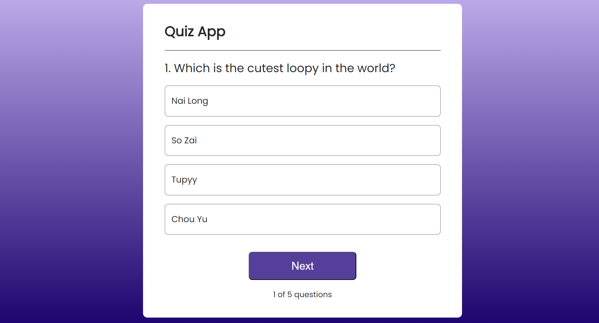
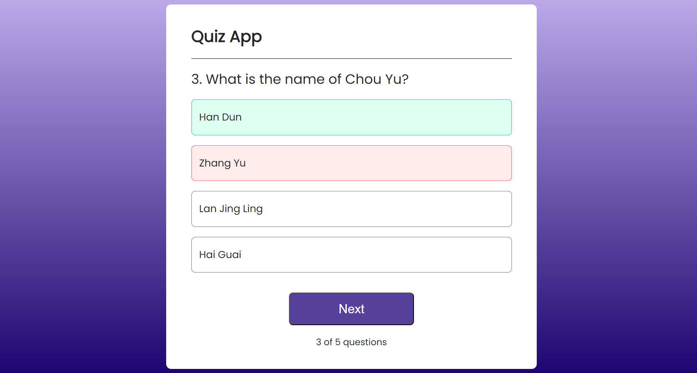

# Quiz App

This project is a web application that utilizes **React.js** for the front end, along with **CSS** for styling. It provides an interactive quiz experience with multiple-choice questions, answer feedback, and score tracking.

## Here is a preview of the app design:

## Technologies Used

-  **React.js**: The core JavaScript library used for building the quiz user interface.
-  **CSS3**: Custom styles (via `Quiz.css`, `Advance.css`, and `Contact.css`) to ensure a clean, modern, and responsive design for the quiz app.
-  **JavaScript (ES6)**: Manages state, renders dynamic components, and controls quiz functionalities like checking answers and showing results.

### Key Components

- **Quiz Logic**: The core quiz logic is handled in `Quiz.jsx` using React hooks such as `useState` and `useRef` to manage the state of questions, answer checking, and score tracking.
- **Answer Feedback**: Provides immediate visual feedback for correct and incorrect answers with color indicators.
- **Score Tracking**: Displays the user's score and allows them to restart the quiz once completed.
- **Responsive Design**: The app is styled with CSS to ensure it adapts well to different screen sizes and devices.

## Features

- Multiple-choice questions with real-time feedback on correct or incorrect answers.
- Score tracking and the ability to reset and retake the quiz.
- Smooth animations and interactive UI components for an engaging user experience.
